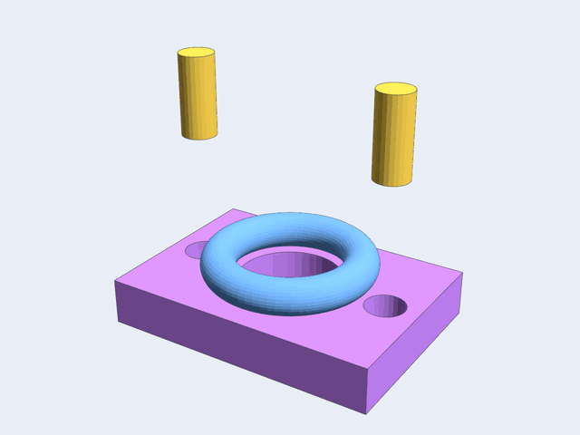
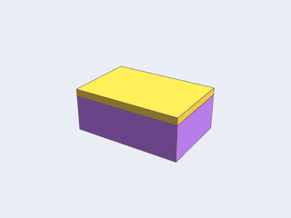
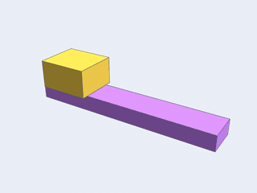
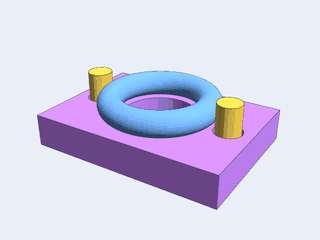
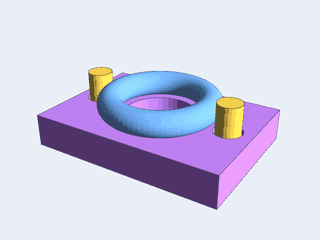
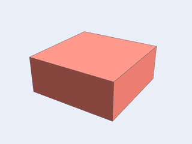
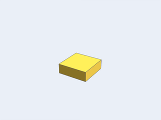

# kinetograph

<p align="center">
  
</p>

An **animation layer** for Go: it moves [decad](https://github.com/lestrrat-3d/decad) bodies, a camera and
lights on a joint rig over time, and renders every frame to a numbered PNG with
[solidlens](https://github.com/lestrrat-3d/solidlens). It writes no video; ffmpeg or another video tool assembles
the PNGs.

> **Work in progress.** The API and supported capabilities may change.

## Why this exists

The first clip kinetograph produces is a landing-page video for decad: decad parts turning, sliding apart and
assembling, seen from a moving camera.

It also changes a body's shape over time. A parametric part rebuilds its decad body from parameters that change
with the frame, so a block can grow wider across a clip.

kinetograph is not a renderer, a video encoder, a physics engine or a CAD kernel. Rendering is solidlens's,
geometry is decad's, coordinate math is [r3](https://github.com/lestrrat-3d/r3)'s and quantities are
[units](https://github.com/lestrrat-3d/units)'s.

## What it does

Every motion below is a `Channel`: `units.Value` keyframes of one kind (an angle, a length, an opacity) with easing
between them. kinetograph renders each clip to PNG frames, and ffmpeg encodes them to a GIF.

| | |
|---|---|
| <br>**Revolute** joints turn a node about an axis through a centre point by an angle channel. | <br>**Prismatic** joints slide a node along a direction by a length channel. |
| <br>**Camera on the rig** attaches the camera to a node, so an orbit is a revolute joint about an axis through the camera's target. | <br>**Node lights** attach to rig nodes like the camera, and `render.Style` gives each one a colour and an intensity channel. |
| <br>**Fade** is a part's opacity channel; `render` mixes a fading part over whatever is behind it. | <br>**Reshape** rebuilds a parametric part's decad body from channel values, once per distinct set of values. |

Regenerate every image on this page with `cd _gallery && go run . > assemble.sh && sh assemble.sh`.

## Usage

[`examples/kinetograph_sequence_example_test.go`](examples/kinetograph_sequence_example_test.go) renders a decad
block turning on one revolute joint while the camera orbits on another.
[`examples/kinetograph_reshape_example_test.go`](examples/kinetograph_reshape_example_test.go) renders a slab whose
width follows a channel. [`examples/kinetograph_appearance_example_test.go`](examples/kinetograph_appearance_example_test.go)
fades a block in while a point light circles it. `go test ./examples/` runs all three and checks their output.

[`_clips/demo/`](_clips/demo/main.go) renders a 4.5 s demo clip: two pins drop into a drilled plate, and a ring
rises off it and turns half a turn while the camera orbits. `cd _clips/demo && go run . -out out` writes 108 frames
at 960x720 into `out/`.

[`_clips/decad-landing/`](_clips/decad-landing/main.go) renders decad's 24 s landing-page clip in three shots: a
flange plate built feature by feature, a shelf of six decad parts, and the DECAD wordmark.
`cd _clips/decad-landing && go run . > assemble.sh && sh assemble.sh` writes 750 frames at 1280x720 into `out/`,
then `out/decad-landing.mp4` and `out/decad-landing.gif`.

Assemble the frames into a video with ffmpeg:

```
ffmpeg -framerate 24 -i frame_%06d.png -c:v libx264 -pix_fmt yuv420p clip.mp4
```

The `yuv420p` pixel format needs an even image width and height. kinetograph does not check this, because it is a
property of that codec.

A failing frame stops the sequence with a `*render.FrameError` that names the frame index and time. The same
inputs give byte-identical PNGs on one Go toolchain and architecture; the rules are in
[docs/design.md](docs/design.md) section 7.

## Layering

```
kinetograph/render   frames to solidlens scenes and PNG files   (imports solidlens)
  |
kinetograph          channels, rig, camera, lights, scene, clip  (this module)
  |
decad                3D bodies and Body.Tessellate               github.com/lestrrat-3d/decad
  |
r3                   vectors, rigid transforms                   github.com/lestrrat-3d/r3
  |
units                typed quantities (Value, Kind)              github.com/lestrrat-3d/units
```

The arrows point **down and never back up**. The root package imports decad, `r3` and `units`; `render` is the
only package that imports solidlens. None of them imports kinetograph.

[sketch](https://github.com/lestrrat-3d/sketch) builds the bodies in the tests, the examples and the `_clips` and
`_gallery` programs. No library package imports it.

## Design

[docs/design.md](docs/design.md) is the contract: the decisions, the public API, the error behaviour, the
determinism rules and the plan for later passes.

## License

This project is **source-available**, and is licensed under the
[PolyForm Noncommercial License 1.0.0](LICENSE).

* **Noncommercial use is free.** Individuals, hobby and personal projects,
  research, education, nonprofits, and government may use, modify, and
  redistribute it at no cost, subject to the license terms.
* **Commercial / business use requires a separate license.** Any use by or for
  a business, or for commercial advantage, is not permitted under the
  noncommercial license. To obtain a commercial license, reach out on Bluesky
  at [@lestrrat.bsky.social](https://bsky.app/profile/lestrrat.bsky.social).

### Contributions

This repository does **not** accept external pull requests.
